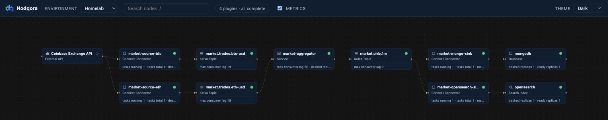
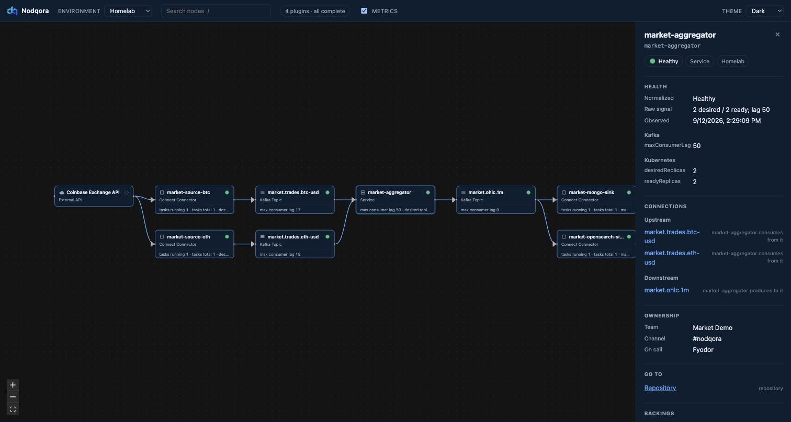
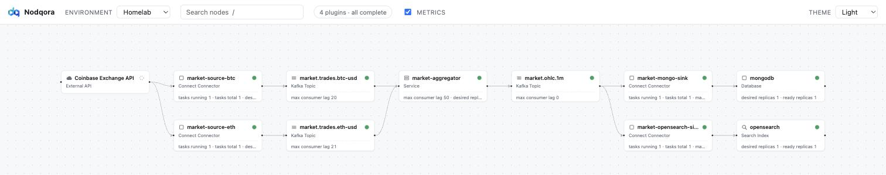

# Nodqora

A topology and health canvas for event-driven systems. The decisions are in
[`CONTEXT.md`](CONTEXT.md) and [`docs/adr/`](docs/adr/); the worked example everything is tested
against is [`docs/reference-pipeline.md`](docs/reference-pipeline.md).



Eleven nodes and eleven edges of the pipeline in [`demo/`](demo/), which runs on a real cluster
against a real third-party API. Four plugins contributed to that canvas and no node names which.

**Status: all five slices merged (ADR-0098).** Four discovery plugins — `yaml`, `kubernetes`,
`kafka`, `connect` — fold into one graph under a configured precedence, three of them also reporting
Health on their own cadence. Production renders at 10 nodes and 9 edges, staging at 7 and 6.

Health carries five values that are **not a ladder**: `UNKNOWN` is an abstention and `DISABLED` is
judgement suspended, so only `HEALTHY < DEGRADED < UNHEALTHY` is a severity order. Alongside it every
plugin reports an `outcome` — **`health` says what we found; `outcome` says how well we looked** — so
a failed poll leaves the last reading standing and says so, rather than turning a node green or red
on evidence nobody gathered.



Selecting a node opens the inspector. `market-aggregator` above is one node carrying what three
plugins each know about it — Kafka's consumer lag, Kubernetes' replica counts, and an ownership
block no plugin can observe, which is why a human wrote it down (ADR-0063).

The canvas follows your desktop's light or dark setting, and the control in the bar pins it either
way (ADR-0160):



## Install

Docker with Compose v2, and nothing else — no JDK and no clone.

```bash
curl -LO https://github.com/nodqora/nodqora/releases/latest/download/compose.yaml
mkdir -p config topology
docker compose up -d
```

Then open **http://localhost:8080**, which will tell you that no environments are configured. That is
a working install: the image ships zero environments on purpose (ADR-0152), because a baked-in one
could be overridden by your config but never removed. Declare one in `./config/application.yaml` and
`docker compose restart nodqora`:

```yaml
nodqora:
  environments:
    homelab:
      display-name: Homelab
      plugins:
        kubernetes:
          namespaces: [n8n, monitoring, actual]
```

**Take `compose.yaml` from the Release, not from this repository** — the copy in the tree names a
`@VERSION@` placeholder and does not run, so that an unpinned install cannot be copied out of `main`
(ADR-0155).

- **[docs/install.md](docs/install.md)** — the whole route: upgrades and the backup they require,
  pointing at a PostgreSQL you already run, what the image bundles, troubleshooting.
- **[docs/running-against-your-own-cluster.md](docs/running-against-your-own-cluster.md)** — the
  configuration and topology grammar, and the join between what you declare and what is observed.

## Layout

```text
nodqora-plugin-api/         immutable records only. No Spring, no persistence, no core dependency.
nodqora-core/            →  depends on plugin-api. Never on a plugin (ADR-0015, enforced by ArchUnit).
nodqora-plugin-yaml/     →  declared topology: the edges and ownership nothing else can observe.
nodqora-plugin-kubernetes/  workloads, Service and Ingress backings, readiness. Emits no edges.
nodqora-plugin-kafka/       topics and consumer-group lag against a threshold you choose.
nodqora-plugin-connect/     connectors and their tasks.
nodqora-app/             →  the deployable: core plus the plugins, wired together.
frontend/                   Vite + React + XYFlow.
fixtures/
  reference-pipeline/       the demo topology, in the product's own format. Not a test double.
  golden/                   ADR-0099's assertions: two graphs, three states, two layouts.
```

## From source

This is the contributor path. To *run* Nodqora, use the install above.

The backend needs PostgreSQL. The schema uses `jsonb`, generated columns and partial unique indexes
over `lower(btrim(...))`, so it is not portable and is not meant to be.

```bash
docker run -d --name nodqora-db -p 5432:5432 \
  -e POSTGRES_DB=nodqora -e POSTGRES_USER=nodqora -e POSTGRES_PASSWORD=nodqora \
  postgres:16-alpine

./gradlew :nodqora-app:bootRun          # http://localhost:8080
cd frontend && npm install && npm run dev   # http://localhost:5173, proxying /api
```

`NODQORA_DB_URL`, `NODQORA_DB_USER` and `NODQORA_DB_PASSWORD` override the connection.

Out of the box this renders the reference pipeline and nothing else: the `kubernetes`, `kafka` and
`connect` blocks point at hosts that do not exist, so the canvas shows the declared topology in grey
with four banners saying so. That is the honesty layer working, not a broken install — every node is
`UNKNOWN` because nothing observed it.

That demo is a **repository** thing, not a shipped one. It lives in
`fixtures/reference-pipeline/application-demo.yaml` beside the topology it names, `bootRun` and the
`test` task both load it, and ADR-0152 keeps it out of the image — a published build declares no
environments, because a baked-in one could be overridden by an operator's config but never removed.

The topology comes from `fixtures/reference-pipeline/{production,staging}/*.yaml`. Editing it is
invisible for up to one discovery cadence — five minutes — which is the accepted cost of there being
no refresh endpoint (ADR-0053). Shorten `nodqora.refresh.discovery` in
`fixtures/reference-pipeline/application-demo.yaml` while iterating; it is config, not code.

## The API

Three GETs, unversioned, unenveloped, read-only (ADR-0053, ADR-0060):

```text
GET /api/meta
GET /api/environments/{envKey}/graph
GET /api/environments/{envKey}/state
```

## Tests

```bash
./gradlew test                 # needs Docker: the integration tests run a real PostgreSQL
cd frontend && npm test        # layout, traversal and phrasing, against the golden documents
cd frontend && npm run typecheck
```

`ReferencePipelineCountsTest` is the only thing in the build that reads
`docs/reference-pipeline.md`, and it reads exactly §4's four numbers (ADR-0099).

**No test reaches a real cluster, broker or Connect worker.** Each plugin's outbound seam is an
interface and everything above it is exercised against a recording, which keeps the suite
deterministic and offline — at the price that "the client cannot start" is a class of defect only
running against real infrastructure will find. #32 was exactly that.

## Getting help

**Open an issue.** That is the whole channel: support for the Apache-2.0 edition
is public, so there is no support email and no private channel, and every answer
is where the next person will find it. Nothing is promised about how fast — in
practice every issue gets read.

The commercial editions, what each one includes, and the response commitment
that comes with the paid one are in [`docs/editions.md`](docs/editions.md).

## Contributing and licence

Everything in this repository is [Apache-2.0](LICENSE) and always will be.
Contributions take a DCO sign-off (`git commit -s`) and there is no CLA — see
[CONTRIBUTING.md](CONTRIBUTING.md) for what that means and why
(ADR-0129, ADR-0130).

Nodqora is open core. A proprietary Enterprise edition lives in a separate
repository and consumes this one's published artifacts; no file here is ever
proprietary, and a capability that ships in Community never becomes paid
(ADR-0128).
